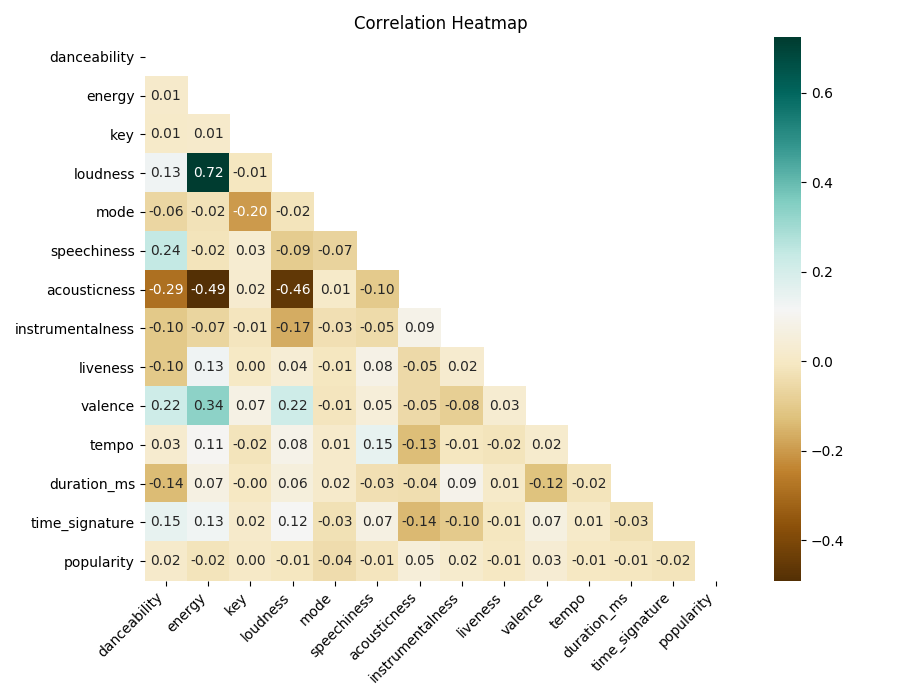
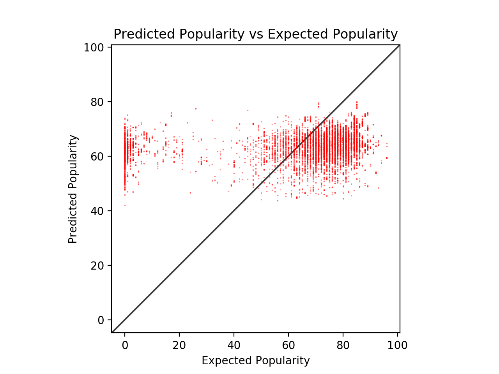
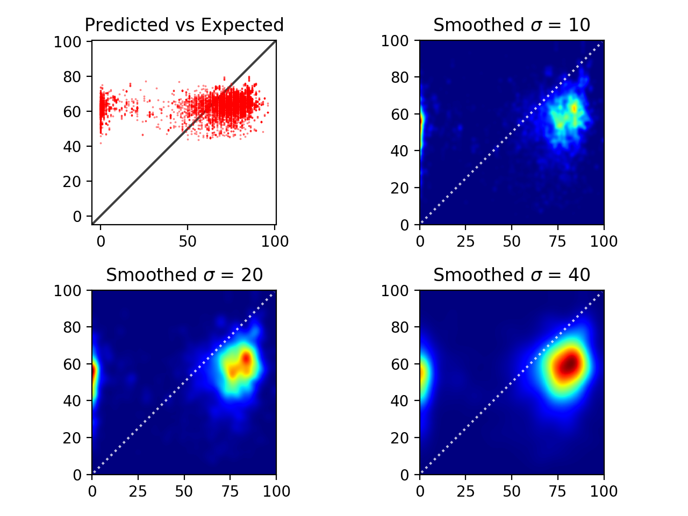

# Analysis Report

- **A defined hypothesis or prediction task, with clearly stated metrics for success.**

  We created models that aim to predict the popularity score of a song given its features (such as artist, tempo, key, acousticness, and more). Our metrics for multiple regression were mean squared error (MSE) and r-squared values. 

- **Why did you use this statistical test or ML algorithm? Which other tests did you consider or evaluate? How did you measure success or failure? Why that metric/value? What challenges did you face evaluating the model? Did you have to clean or restructure your data?**

  We selected multiple regression as our first model for several reasons. First, our data is rich with detailed features for each song, and we thought that multiple regression would be much better at making full use of this information than other models such as linear regression. Second, we wanted a model that was more explainable than, say, a deep learning neural net, which we planned to be our next model. We measured our success using MSE and r-squared. We chose these values because we learned in class that they are reflective of how close the predicted values are to the actual values. Both MSE and r-squared are included because they measure slightly different things: the former, the distances between the predicted points and the targets, and the latter, the percentage of variability in the data explained by our model. In order to use this model, we had to clean our data by turning categorical values (e.g. artist names) into numerical ones. We encoded these variables into integers by creating a vocabulary that mapped each categorical value to unique ids. 

- **What is your interpretation of the results? Do accept or deny the hypothesis, or are you satisfied with your prediction accuracy? For prediction projects, we expect you to argue why you got the accuracy/success metric you have. Intuitively, how do you react to the results? Are you confident in the results?**

  Our predictions are definitely not the most accurate. Our training MSE is around 711, our testing MSE around 678, and our r-squared around 0.03. In other words, not only were many of our predictions distant from actual values, our model also explained only a miniscule portion of the variability in the data. We have several conjectures as to why the model performs so poorly, many of which are supported by the visualizations discussed in the next section. In short, our model seems to be unsuccessful because while the popularity scores in the data range from 0-100, our model only outputs predictions on the 40-80 range. Therefore, the model fails to make accurate predictions for many of the less popular songs. 

- **For your visualization, why did you pick this graph? What alternative ways might you communicate the result? Were there any challenges visualizing the results, if so, what where they? Will your visualization require text to provide context or is it standalone (either is fine, but it's recognize which type your visualization is)?**

  First, we used a [heatmap](../visualizations/features_heatmap.png) to display the correlations between all the song features. This was to display any strong correlations a music feature may have with popularity and to single out features that had stronger correlations than others. An alternative way to communicate the result would be to use a bar graph and just display the correlation of each feature to popularity, instead of also showing the correlation between music features to other music features. There were not many challenges for this visualization other than making sure the axis labels were not cut off. This visualization will require text to provide context since it is not entirely clear what the heatmap displays. 

  Another visualization we used was a [scatter plot](../visualizations/predicted_scatter.png) with the expected probability as the x-axis and the predicted probability as the y-axis. We used this visualization to show how well the model performed. If the visualization had 100% accuracy, we would expect to see a general trend line of y=x (45 degree line). One challenge we came across was the ambiguity of the scatter plot since there were so many data points. This was addressed by creating a [smoothed scatter plot](../visualizations/predicted_smoothed.png) by applying a gaussian filter and 2d-histogram binning to get a better sense of where the bulk of the points were on the plot. This visualization will also need some text to provide context, especially in relation to the histogram binning method. 

- **Full results + graphs (at least 1 stats/ml test and at least 1 visualization).**
  
  Process for the model can be found here: [multiple regression](../../Workspace/Code/regression/multiple_regression.py)

  Results (approximations): 
  - Training MSE: 711 
  - Testing MSE: 678
  - R-squared: 0.03.

  Process for visualizations can be found here: [heatmap](../../Workspace/Visualizations/heatmap.py) and [scatter](../../Workspace/Visualizations/regression.py)

  Graphs:

   
  
  

- **If you did a machine learning model, why did you choose this machine learning technique? Does your data have any sensitive/protected attributes that could affect your machine learning model?**
 
  Although we did not use a machine learning model for this analysis deliverable, we plan on using a machine learning model to compare the prediction results between different techniques. We plan on using a artifical neural network and we believe this machine learning technique will allow us to predict with better accuracy since it will be able to learn more complex relationships between the music features. We do not think there are sensitive/protected attributes that could affect the results. One possible hidden attribute could be monetary incentives or relationships between artists and Spotify, however, we believe the popularity of most songs are "organic" and not artifically boosted by Spotify's promotion. 
  
- **Discussion of visualization/explaining your results on a poster and a discussion of future directions.**
 
  The visualizations were discusses above, but in sum, there are very weak direct correlations between any of the features and a song's popularity, with most of the correlations for popularity being within the range of -0.05 and 0.05. For the regression's predictions, there seems to be a moderately low accuracy in the predictions. However, we also found that some popularity values are very low and could be leading to poor results. We are not entirely sure why there are songs with a popularity score of less than 5, and we plan on retreiving the data for these songs again or filtering them out. We also plan on applying different models such as SVM and neural nets to see if we can get better results and find more complex relationships. 